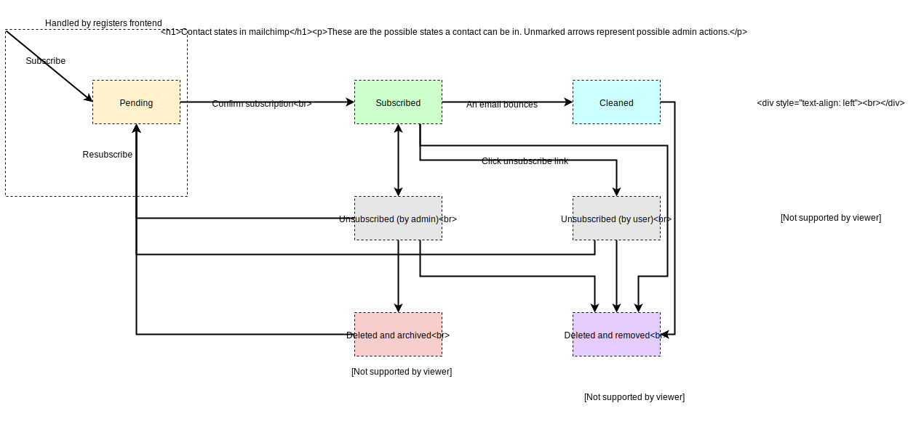

# 2. Use an external service for email

Date: 2018-08-23

## Status

Accepted

## Context

We need a way to communicate changes to the registers service to our users.

For example: breaking changes to the API, or new registers that have become available.

We have previously collected contact information, but not actually sent any emails.

## Decision
We reviewed the [service manual guidance on sending email](https://www.gov.uk/service-manual/technology/how-to-email-your-users).

We reviewed the use of GOV.UK Notify for managing email subscribers, but found that it only handles the email sending part, and does not currently provide a way to manage lists of subscribers. The GOV.UK team at GDS did use Notify for this purpose, but they built extra software around it to manage subscriptions. This is too complex for our use case, and email is not central to our product, so we've decided not to use Notify right now.

We decided to use mailchimp as it's a technology already in use by other teams at GDS, and the free tier can handle the number of subscribers we'll have in the forseeable future.

We will continue to use Registers Frontend for the signup form, and use the API to integrate with mailchimp.

Instead of migrating existing subscribers, we'll send them an email with instructions on how to sign up again, so it's clear what they are signing up for.

## Consequences
We will no longer need to store any personal data on our servers, but mailchimp will store personal data on our behalf (the email address).

We will not need to create our own forms to allow users to unsubscribe, but contacts in mailchimp can exist in various different states that we will need to manage through their admin interface.

Mailchimp detects whether emails failed to be delivered and will move them to the [cleaned state](https://mailchimp.com/help/about-cleaned-contacts/). It's best practice to just delete these emails.

If users request their data to be removed, mailchimp will contact us and we will need to [delete and remove the contact](https://mailchimp.com/help/delete-contacts/) within 30 days.

If registers frontend fails to subscribe a user through the API, the user will have the option to contact us so we can resolve the problem. This can happen if the user has previously been permanently removed, in which case they can only sign up again through a mailchimp-provided form.